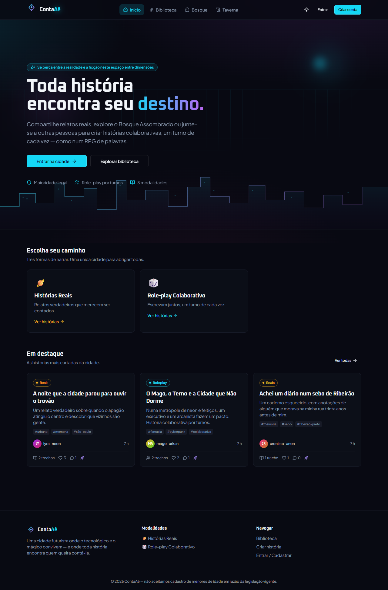

# 📚 ContaAê

> **Se perca entre a realidade e a ficção neste espaço entre dimensões.**

Plataforma colaborativa de contação de histórias numa cidade futurista onde magia e tecnologia convivem. Relatos reais, role-play por turnos, quests mediados por Game Master e um fórum assombrado — com uma IA narradora opcional que co-escreve quando convidada.



## ✨ Modalidades

| | Modalidade | Como funciona |
|---|---|---|
| 🪐 | **Histórias Reais** | Relatos verdadeiros que merecem ser contados |
| 🎲 | **Role-play Colaborativo** | Escrita em conjunto, um turno de cada vez — como num RPG de palavras |
| 🍺 | **Taverna (Quests)** | RP puro mediado por GM: sem dados, sem pontos de vida, só texto e imaginação |
| 👻 | **Bosque Assombrado** | Fórum de creepypastas com respostas encadeadas |

## 🤖 IA que colabora, não substitui

- **Narradora convidada**: qualquer participante pode chamar a IA para escrever o próximo trecho. Ela nunca escreve duas vezes seguidas e seus trechos são sempre identificados.
- **Moderação assistida**: toda publicação é classificada pela IA em segundo plano (nunca bloqueia nem remove nada sozinha). Casos suspeitos viram sinalizações para revisão **humana** por moderadores.
- Funciona com a API da Anthropic (cloud) ou com um modelo local via Ollama/LM Studio — e o app inteiro funciona normalmente sem IA nenhuma.

## 🛡️ Princípios da plataforma

- **Maioridade**: cadastro somente para maiores de 18 anos.
- **Pseudônimos obrigatórios**: nomes de usuário que pareçam nomes reais são rejeitados, e conteúdo que exponha pessoas reais é sinalizado — proteção de identidade em primeiro lugar.
- **Privacidade**: e-mail e data de nascimento nunca aparecem para outros usuários.
- **Moderação humana**: a palavra final sobre qualquer conteúdo é sempre de uma pessoa.

## 🧱 Stack

React 18 + Vite + TypeScript · Tailwind CSS + shadcn/ui · TanStack Query · Express · Drizzle ORM + SQLite · Anthropic SDK

## 🚀 Rodando localmente

```bash
git clone https://github.com/InquirerHS/ContaAe.git
cd ContaAe
npm install
cp .env.example .env   # opcional: chave da IA
npm run dev            # http://localhost:5000
node seed.mjs          # opcional: dados de demonstração
```

Mais detalhes (scripts, contas de teste, promoção de moderadores) no [guia de contribuição](CONTRIBUTING.md); a referência técnica completa — modelo de dados, API, regras de negócio — está na [documentação](DOCUMENTACAO.md).

## 📄 Licença

[MIT](LICENSE)
